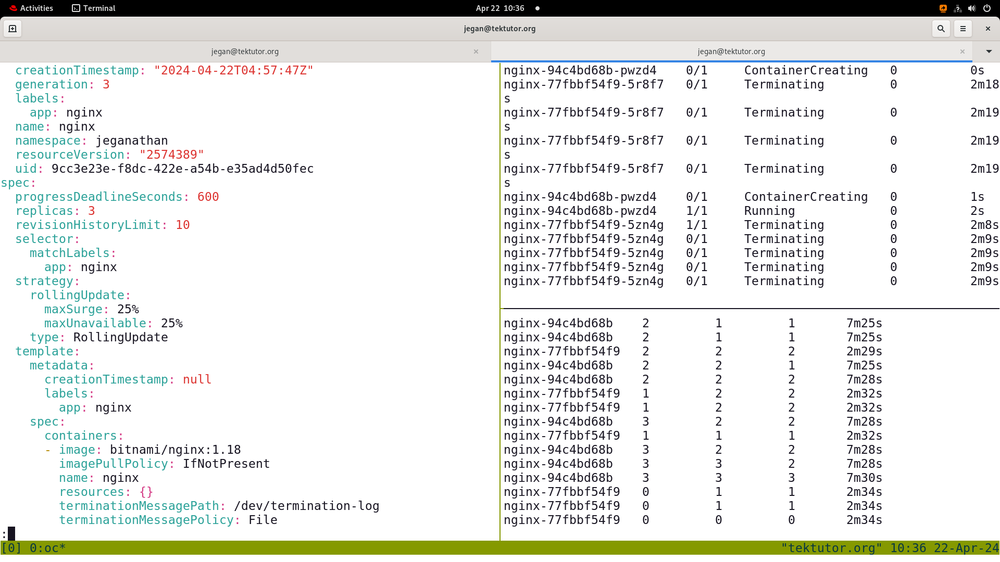
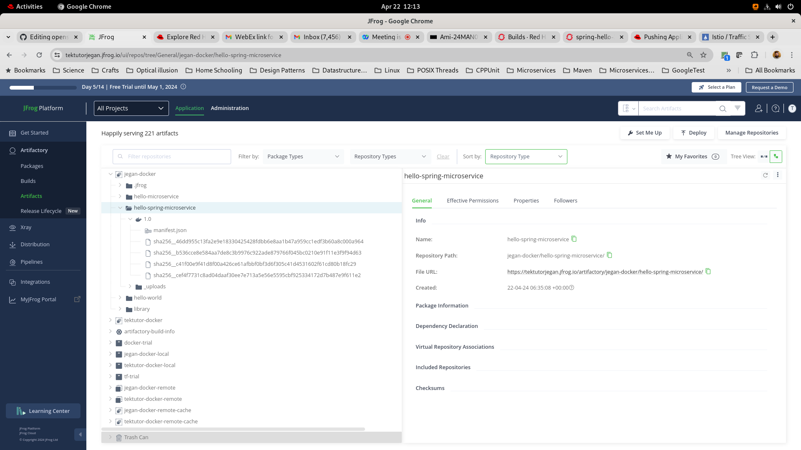

# Day 5

## Rolling update
- helps us upgrade your microservice or application from one version to other without any downtime
- you just need to update the container image version to whatever version you need to upgrade and apply the yaml files
- you could even undo, check all revisions, downgrade to any lower version of your application

## Lab - Nginx Rolling update from v1.18 to v1.19

Deploy nginx v1.18

When you edit the deploy, make sure you are not really changing anything but observe the version of nginx image. You should see the deployment using bitnami/nginx:1.18
```
cd ~/openshift-april-2024
git pull

cd Day5/rolling-update
oc apply -f nginx-deploy.yml
oc apply -f nginx-clusterip-svc.yml
oc apply -f nginx-route.yml
oc get deploy,rs,po
oc edit deploy/nginx
```

Now let's do rolling update ( upgrade nginx from v1.18 to v1.19. Edit the nginx-deploy.yml file and update the bitnami/nginx:1.18 to bitnami/nginx:1.19 save the file and apply
```
oc apply -f nginx-deploy.yml
oc edit deploy/nginx
```

You could check the status of the rolling update
```
oc rollout status deploy/nginx
```

You list all revisions
```
oc rollout history deploy/nginx
```

You can undo back to older version
```
oc rollout undo deploy/nginx
```


## Lab - Buildconfig

This build config does the following
- clones the github repo https://github.com/tektutor/openshift-april-2024
- builds the java spring boot application under Day5/BuildConfig folder
- builds a custom docker image and pushes the image to image stream named tektutor-spring-hello
- it follows Docker strategy, hence it looks for Dockerfile under Day5/BuildConfig folder
- it follows the instructions in the Dockerfile

First create the image stream where the newly built application image will be stored
```
cd ~/openshift-april-2024
git pull
cd Day5/BuildConfig
oc create is tektutor-spring-hello
```

Expected output
<pre>
[root@tektutor.org BuildConfig]# oc create is tektutor-spring-hello
imagestream.image.openshift.io/tektutor-spring-hello created  
</pre>  

Now you can create the build config
```
cd ~/openshift-april-2024
git pull
cd Day5/BuildConfig

oc apply -f buildconfig.yml
```

You can track the status of the build from command line
```
oc logs -f bc/spring-hello
```

You can also track the build status from the openshift web console as Developer/Administrator under Builds

## Lab - Build application jar, create custom image with application jar and push the image to JFrog Artifactory Private Image registry

This build config does the following
<pre>
- clones the github repo https://github.com/tektutor/openshift-april-2024.git
- builds the java spring boot application under Day5/BuildConfig folder
- builds a custom docker image and pushes the image to 
it follows Docker strategy, hence it looks for Dockerfile under Day5/BuildConfig folder
it follows the instructions in the Dockerfile
</pre>
Create a secret with the login credentials of your JFrog Artifactory
```
oc create secret docker-registry private-jfrog-image-registry-new --docker-server=tektutorjegan.jfrog.io --docker-username=your-jfrog-registered-email --docker-password=your-jfrog-password
```

You need to update the buildconfig-pushto-artifactory.yml under Day5/BuildConfig to match the JFrog url and docker registry as per your JFrog setup.  The start-build command, creates an instance of the buildconfig called build.  For each build one Pod will be created to run the applicaiton build followed by image build. 

```
cd ~/openshift-april-2024
git pull

cd Day5/BuildConfig
oc apply -f buildconfig-pushto-artifactory.yml
oc get buildconfigs
oc start-build bc/hello
oc logs -f bc/hello
```

Expected output
<pre>
[root@tektutor.org BuildConfig]# <b>oc apply -f buildconfig-pushto-artifactory.yml</b>
buildconfig.build.openshift.io/hello configured
	
[root@tektutor.org BuildConfig]# <b>oc get builds</b>
No resources found in jeganathan namespace.
	
[root@tektutor.org BuildConfig]# <b>oc get bc</b>
NAME           TYPE     FROM       LATEST
hello          Docker   Git@main   2
spring-hello   Docker   Git@main   3
	
[root@tektutor.org BuildConfig]# <b>oc start-build hello</b>
build.build.openshift.io/hello-3 started
	
[root@tektutor.org BuildConfig]# <b>oc logs -f bc/hello</b>
Cloning "https://github.com/tektutor/openshift-april-2024.git" ...
	Commit:	0780a85349a9f4e50c035ef6088f8de6e32dae57 (Update README.md)
	Author:	Jeganathan Swaminathan <mail2jegan@gmail.com>
	Date:	Mon Apr 22 11:47:29 2024 +0530
time="2024-04-22T06:33:53Z" level=info msg="Not using native diff for overlay, this may cause degraded performance for building images: kernel has CONFIG_OVERLAY_FS_REDIRECT_DIR enabled"
I0422 06:33:53.515929       1 defaults.go:112] Defaulting to storage driver "overlay" with options [mountopt=metacopy=on].
Caching blobs under "/var/cache/blobs".

Pulling image docker.io/maven:3.6.3-jdk-11 ...
Trying to pull docker.io/library/maven:3.6.3-jdk-11...
Getting image source signatures
Copying blob sha256:6c215442f70bd949a6f2e8092549943905e2d4f9c87a4f532d7740ae8647d33a
Copying blob sha256:5d6f1e8117dbb1c6a57603cb4f321a861a08105a81bcc6b01b0ec2b78c8523a5
Copying blob sha256:234b70d0479d7f16d7ee8d04e4ffdacc57d7d14313faf59d332f18b2e9418743
Copying blob sha256:48c2faf66abec3dce9f54d6722ff592fce6dd4fb58a0d0b72282936c6598a3b3
Copying blob sha256:d7eb6c022a4e6128219b32a8e07c8c22c89624ff440ebac1506121794bc15ccc
Copying blob sha256:004f1eed87df3f75f5e2a1a649fa7edd7f713d1300532fd0909bb39cd48437d7
Copying blob sha256:355e8215390faee903502a9fddfc65cd823f1606f053376ba2575adce66974a1
Copying blob sha256:cf5eb43522f68d7e2347e19ad70dadcf1594d25b792ede0464c2936ff902c4c6
Copying blob sha256:4fee0489a65b64056f81358639bfe85fd87776630830fd02ce8c15e34928bf9c
Copying blob sha256:413646e6fa5d7bcd9722d3e400fc080a77deb505baed79afa5fedae23583af25
Copying config sha256:e23b595c92ada5c9f20a27d547ed980a445f644eb1cbde7cfb27478fa38c4691
Writing manifest to image destination

Pulling image registry.access.redhat.com/ubi8/openjdk-11 ...
Trying to pull registry.access.redhat.com/ubi8/openjdk-11:latest...
Getting image source signatures
Copying blob sha256:0bb48edf8994fcf133c612f92171d68f572091fb0b1113715eab5f3e5e7f54e5
Copying blob sha256:74e0c06e5eac269967e6970582b9b25168177df26dffed37ccde09369302a87a
Copying config sha256:a6b53e10c7678edc1d2e8090ed0a0b40d147f8e110ac2277931828ef11276f96
Writing manifest to image destination
Adding transient rw bind mount for /run/secrets/rhsm
[1/2] STEP 1/3: FROM docker.io/maven:3.6.3-jdk-11 AS stage1
[1/2] STEP 2/3: COPY . .
--> cead7868b38c
[1/2] STEP 3/3: RUN mvn clean package
[INFO] Scanning for projects...
Downloading from central: https://repo.maven.apache.org/maven2/org/springframework/boot/spring-boot-starter-parent/2.4.2/spring-boot-starter-parent-2.4.2.pom
Downloaded from central: https://repo.maven.apache.org/maven2/org/springframework/boot/spring-boot-starter-parent/2.4.2/spring-boot-starter-parent-2.4.2.pom (8.6 kB at 21 kB/s)
Downloading from central: https://repo.maven.apache.org/maven2/org/springframework/boot/spring-boot-dependencies/2.4.2/spring-boot-dependencies-2.4.2.pom
Downloaded from central: https://repo.maven.apache.org/maven2/org/springframework/boot/spring-boot-dependencies/2.4.2/spring-boot-dependencies-2.4.2.pom (108 kB at 1.1 MB/s)
Downloading from central: https://repo.maven.apache.org/maven2/com/datastax/oss/java-driver-bom/4.9.0/java-driver-bom-4.9.0.pom
Downloaded from central: https://repo.maven.apache.org/maven2/com/datastax/oss/java-driver-bom/4.9.0/java-driver-bom-4.9.0.pom (4.1 kB at 78 kB/s)
Downloading from central: https://repo.maven.apache.org/maven2/io/dropwizard/metrics/metrics-bom/4.1.17/metrics-bom-4.1.17.pom

n" "io.openshift.build.name"="hello-3" "io.openshift.build.namespace"="jeganathan" "io.openshift.build.source-context-dir"="Day5/BuildConfig" "io.openshift.build.source-location"="https://github.com/tektutor/openshift-april-2024.git"
[2/2] COMMIT temp.builder.openshift.io/jeganathan/hello-3:d1d5a476
--> 46dd955c13fa
Successfully tagged temp.builder.openshift.io/jeganathan/hello-3:d1d5a476
46dd955c13fa2e9e18330425428fdbb6e8aa1b47a959cc1edf3b60a8c000a964

Pushing image tektutorjegan.jfrog.io/jegan-docker/hello-spring-microservice:1.0 ...
Getting image source signatures
Copying blob sha256:4035597b323226f1a21d971e7c4d2336e002e1340cb17dfba67c13dd59042ada
Copying blob sha256:74e0c06e5eac269967e6970582b9b25168177df26dffed37ccde09369302a87a
Copying blob sha256:0bb48edf8994fcf133c612f92171d68f572091fb0b1113715eab5f3e5e7f54e5
Copying config sha256:46dd955c13fa2e9e18330425428fdbb6e8aa1b47a959cc1edf3b60a8c000a964
Writing manifest to image destination
Successfully pushed tektutorjegan.jfrog.io/jegan-docker/hello-spring-microservice@sha256:626a4472163b4c4d7d92e37fbfc5dd059af0330182ab1c1369fb23e87f028bf9
Push successful
</pre>  

At this point you should be able to check the image pushed into your JFrog Artifactory Docker Registry


Once the image is successfully pushed, you can check your Jfrog artifactory repository.

## Lab - Using source strategy to build application jar, build custom image and deploy application,service and route
```
oc new-app registry.access.redhat.com/ubi8/openjdk-11~https://github.com/tektutor/openshift-april-2024.git --context-dir=Day5/DevfileAndDeployDemo/spring-ms --strategy=source
```

## Knative Serverless
<pre>
- Knative is an open source community project 
- adds components for deploying, running, and managing serverless, cloud-native applications to Kubernetes/Openshift
- The serverless cloud computing model can lead to increased developer productivity and reduced operational costs
- Knative eliminates the tasks of provisioning and managing servers
- code only runs when it needs to, with Knative starting and stopping instances automatically
- Operations costs can be reduced — pay for cloud-based compute time on demand, instead of running and managing your own servers all the time

- Knative consists of 3 primary components:
  - Build - A flexible approach to building source code into containers
  - Serving - Enables rapid deployment and automatic scaling of containers through a request-driven model for serving workloads based on demand
  - Eventing - An infrastructure for consuming and producing events to stimulate applications. Applications can be triggered by a variety of sources, such as events from your own applications, cloud services from multiple providers, Software-as-a-Service (SaaS) systems, and Red Hat AMQ streams
</pre>

## Lab - Deploying application from our custom Docker image in the JFrog Artifactory Private Image Registry
```
cd ~/openshift-april-2024
git pull

cd Day5/BuildConfig

oc apply -f hello-deploy.yml
oc apply -f hello-svc.yml
oc apply -f hello-route.yml

oc get route
```

Expected output
<pre>
[root@tektutor.org openshift-april-2024]# oc describe route hello
Name:			hello
Namespace:		jeganathan
Created:		3 minutes ago
Labels:			app=hello
Annotations:		openshift.io/host.generated=true
Requested Host:		hello-jeganathan.apps.ocp4.tektutor.org.labs
			   exposed on router default (host router-default.apps.ocp4.tektutor.org.labs) 3 minutes ago
Path:			<none>
TLS Termination:	<none>
Insecure Policy:	<none>
Endpoint Port:		8080

Service:	hello
Weight:		100 (100%)
Endpoints:	10.128.2.61:8080, 10.129.0.106:8080, 10.131.0.67:8080
	
[root@tektutor.org openshift-april-2024]# curl hello-jeganathan.apps.ocp4.tektutor.org.labs
Hello Microservice !	
</pre>

## Lab - Deploying a knative service
```
kn service create hello \
--image ghcr.io/knative/helloworld-go:latest \
--port 8080 \
--env TARGET=World
```

Expected output
<pre>
[jegan@tektutor.org ~]$ kn service create hello \
--image ghcr.io/knative/helloworld-go:latest \
--port 8080 \
--env TARGET=World
Warning: Kubernetes default value is insecure, Knative may default this to secure in a future release: spec.template.spec.containers[0].securityContext.allowPrivilegeEscalation, spec.template.spec.containers[0].securityContext.capabilities, spec.template.spec.containers[0].securityContext.runAsNonRoot, spec.template.spec.containers[0].securityContext.seccompProfile
Creating service 'hello' in namespace 'jegan':

  0.051s The Route is still working to reflect the latest desired specification.
  0.063s ...
  0.084s Configuration "hello" is waiting for a Revision to become ready.
  5.347s ...
  5.385s Ingress has not yet been reconciled.
  5.457s Waiting for load balancer to be ready
  5.618s Ready to serve.

Service 'hello' created to latest revision 'hello-00001' is available at URL:
https://hello-jegan.apps.ocp4.tektutor.org.labs  
</pre>

Listing the knative services
```
kn service list
kubectl get ksvc
```

#### Accessing the knative application
```
curl -k https://hello-jegan.apps.ocp4.tektutor.org.labs
```

Expected output
<pre>
[jegan@tektutor.org ~]$ curl -k https://hello-jegan.apps.ocp4.tektutor.org.labs
Hello World!
</pre>

#### Update the service
```
kn service update hello \
--env TARGET=Knative

kn revisions list
```

Expected output
<pre>
[jegan@tektutor.org ~]$ kn service update hello \
--env TARGET=Knative
Warning: Kubernetes default value is insecure, Knative may default this to secure in a future release: spec.template.spec.containers[0].securityContext.allowPrivilegeEscalation, spec.template.spec.containers[0].securityContext.capabilities, spec.template.spec.containers[0].securityContext.runAsNonRoot, spec.template.spec.containers[0].securityContext.seccompProfile
Updating Service 'hello' in namespace 'jegan':

  0.035s The Configuration is still working to reflect the latest desired specification.
  3.410s Traffic is not yet migrated to the latest revision.
  3.454s Ingress has not yet been reconciled.
  3.509s Waiting for load balancer to be ready
  3.666s Ready to serve.

Service 'hello' updated to latest revision 'hello-00002' is available at URL:
https://hello-jegan.apps.ocp4.tektutor.org.labs  

[jegan@tektutor.org ~]$ kn revision list
NAME          SERVICE   TRAFFIC   TAGS   GENERATION   AGE   CONDITIONS   READY   REASON
hello-00002   hello     100%             2            55s   4 OK / 4     True    
hello-00001   hello                      1            10m   3 OK / 4     True    
</pre>

#### Splitting the traffic between two revisions
```
kn service update hello \
--traffic hello-00001=50 \
--traffic @latest=50

kn revisions list
```

Expected output
<pre>
[jegan@tektutor.org ~]$ kn service update hello \
--traffic hello-00001=50 \
--traffic @latest=50
Warning: Kubernetes default value is insecure, Knative may default this to secure in a future release: spec.template.spec.containers[0].securityContext.allowPrivilegeEscalation, spec.template.spec.containers[0].securityContext.capabilities, spec.template.spec.containers[0].securityContext.runAsNonRoot, spec.template.spec.containers[0].securityContext.seccompProfile
Updating Service 'hello' in namespace 'jegan':

  0.035s The Route is still working to reflect the latest desired specification.
  0.064s Ingress has not yet been reconciled.
  0.084s Waiting for load balancer to be ready
  0.277s Ready to serve.

Service 'hello' with latest revision 'hello-00002' (unchanged) is available at URL:
https://hello-jegan.apps.ocp4.tektutor.org.labs
  
[jegan@tektutor.org ~]$ kn revision list
NAME          SERVICE   TRAFFIC   TAGS   GENERATION   AGE   CONDITIONS   READY   REASON
hello-00002   hello     50%              2            88s   3 OK / 4     True    
hello-00001   hello     50%              1            10m   3 OK / 4     True      
</pre>

#### Accessing the knative application
```
kn revision list
curl -H 'Pragma: no-cache' -k "$(kn service describe hello -o url)"
curl -H 'Pragma: no-cache' -k "$(kn service describe hello -o url)"
curl -H 'Pragma: no-cache' -k "$(kn service describe hello -o url)"
curl -H 'Pragma: no-cache' -k "$(kn service describe hello -o url)"
```

Expected output
<pre>
[jegan@tektutor.org ~]$ kn revision list
NAME          SERVICE   TRAFFIC   TAGS   GENERATION   AGE     CONDITIONS   READY   REASON
hello-00002   hello     50%              2            3m34s   3 OK / 4     True    
hello-00001   hello     50%              1            12m     3 OK / 4     True    
[jegan@tektutor.org ~]$ #curl -H 'Pragma: no-cache' -k "$(kn service describe hello -o url)"
[jegan@tektutor.org ~]$ curl -H 'Pragma: no-cache' -k "$(kn service describe hello -o url)"
Hello Knative!
[jegan@tektutor.org ~]$ curl -H 'Pragma: no-cache' -k "$(kn service describe hello -o url)"
Hello World!
[jegan@tektutor.org ~]$ curl -H 'Pragma: no-cache' -k "$(kn service describe hello -o url)"
Hello Knative!
[jegan@tektutor.org ~]$ curl -H 'Pragma: no-cache' -k "$(kn service describe hello -o url)"
Hello Knative!
</pre>

## Lab - Delete the knative service
```
kn service list
kn service delete hello
kn service list
```

Expected output
<pre>
[jegan@tektutor.org ~]$ kn service list
NAME    URL                                               LATEST        AGE   CONDITIONS   READY   REASON
hello   https://hello-jegan.apps.ocp4.tektutor.org.labs   hello-00002   16m   3 OK / 3     True    
[jegan@tektutor.org ~]$ kn service delete hello
Service 'hello' successfully deleted in namespace 'jegan'.
  
[jegan@tektutor.org ~]$ kn service list
No services found.  
</pre>

## Lab - knative eventing

Let's deploy a sink Service
```
oc new-project jegan
kn service create eventinghello --concurrency-target=1 --image=quay.io/rhdevelopers/eventinghello:0.0.2
```

Expected output
<pre>
[root@tektutor.org eventing]# oc new-project jegan
Already on project "jegan" on server "https://api.ocp4.tektutor.org.labs:6443".

You can add applications to this project with the 'new-app' command. For example, try:

    oc new-app rails-postgresql-example

to build a new example application in Ruby. Or use kubectl to deploy a simple Kubernetes application:

    kubectl create deployment hello-node --image=registry.k8s.io/e2e-test-images/agnhost:2.43 -- /agnhost serve-hostname

[root@tektutor.org eventing]# kn service create eventinghello --concurrency-target=1 --image=quay.io/rhdevelopers/eventinghello:0.0.2
Warning: Kubernetes default value is insecure, Knative may default this to secure in a future release: spec.template.spec.containers[0].securityContext.allowPrivilegeEscalation, spec.template.spec.containers[0].securityContext.capabilities, spec.template.spec.containers[0].securityContext.runAsNonRoot, spec.template.spec.containers[0].securityContext.seccompProfile
Creating service 'eventinghello' in namespace 'jegan':

  0.053s The Route is still working to reflect the latest desired specification.
  0.085s ...
  0.095s Configuration "eventinghello" is waiting for a Revision to become ready.
 41.216s ...
 41.269s Ingress has not yet been reconciled.
 41.365s Waiting for load balancer to be ready
 41.547s Ready to serve.

Service 'eventinghello' created to latest revision 'eventinghello-00001' is available at URL:
https://eventinghello-jegan.apps.ocp4.tektutor.org.labs	
</pre>

Create a event source application
```
kn source ping create eventinghello-ping-source --schedule "*/2 * * * *" --data '{"message": "Thanks for your message"}' --sink ksvc:eventinghello
```

# Post test link for Adv Containerization training ( complete this from RPS Cloud Lab Machine )
https://app.mymapit.in/code4/tiny/XyfvWS


# Feedback link
https://survey.zohopublic.com/zs/YK05Cm

 
